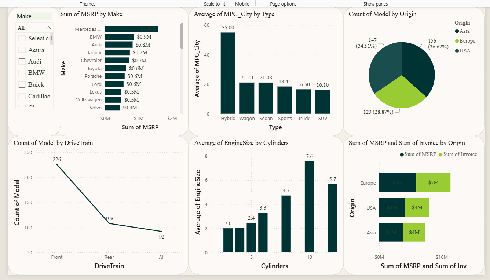
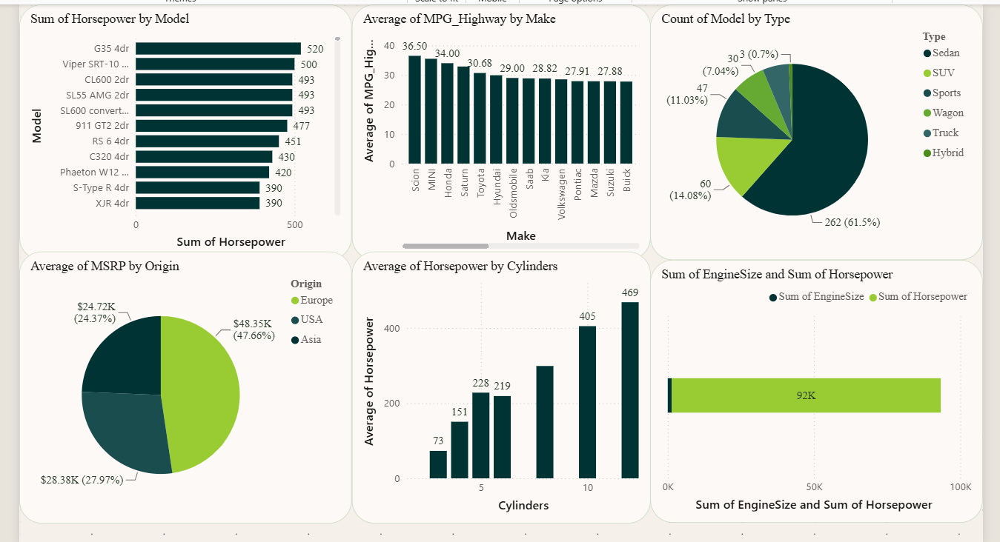
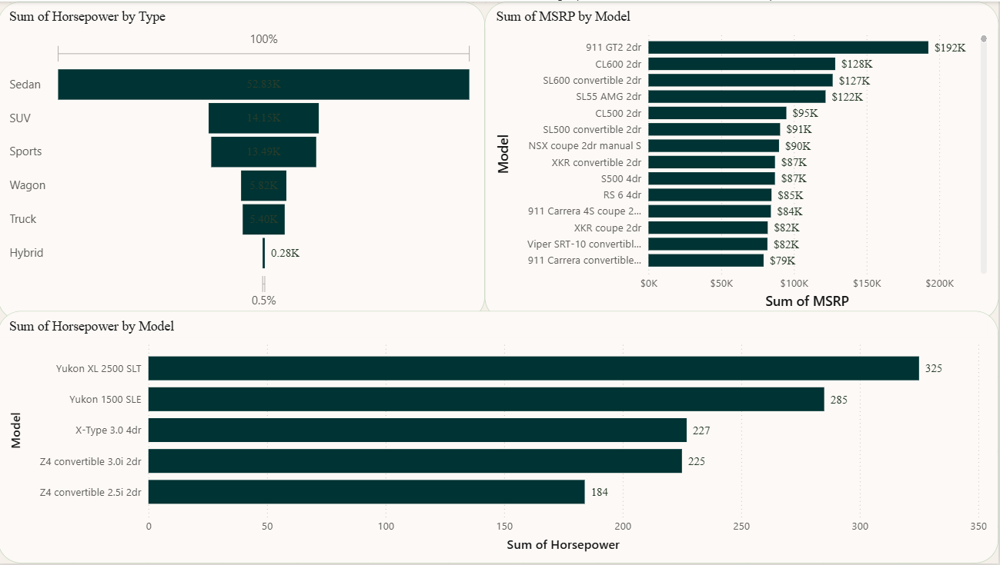

<div align="center">

# 🚗 Cars Analytics Dashboard

### 📊 Interactive Power BI Dashboard for Automotive Data Analysis

<p>
  
  
  
  
</p>

Analyze vehicle pricing, engine performance, fuel efficiency, and market trends using an interactive Power BI dashboard.

</div>

---

# 📖 Project Overview

This project presents a **Power BI dashboard** built using the **Cars Dataset**. It helps users explore manufacturer performance, pricing, fuel efficiency, engine specifications, and market distribution through interactive charts and filters.

The dashboard is designed to support business users in identifying trends, comparing vehicle specifications, and making data-driven decisions.

---

# 🎯 Objectives

- 🚗 Analyze vehicle pricing across manufacturers
- 💰 Compare MSRP and Invoice prices
- ⚙️ Evaluate horsepower and engine size
- ⛽ Study city fuel efficiency (MPG)
- 🌍 Compare vehicle origin and type
- 📊 Build an interactive business dashboard

---

# ✨ Dashboard Features

- 🎛 Interactive slicers and filters
- 📈 MSRP Analysis
- 💵 Invoice Price Comparison
- ⚙️ Engine Size & Horsepower Analysis
- ⛽ Fuel Efficiency Analysis
- 🌎 Vehicle Origin Distribution
- 🚘 Vehicle Type Analysis
- 📊 Dynamic charts with cross-filtering

---

# 🛠 Tech Stack

| Technology | Usage |
|------------|-------|
| 📊 Microsoft Power BI | Dashboard Development |
| ⚡ DAX | Measures & Calculations |
| 🔄 Power Query | Data Cleaning & Transformation |
| 📄 CSV | Dataset |

---

# 📸 Dashboard Preview

## 🏠 Executive Dashboard

<p align="center">

</p>

Shows manufacturer pricing, vehicle origin, drivetrain, engine size, and fuel efficiency.

---

## 🚘 Performance Dashboard

<p align="center">

</p>

Provides insights into horsepower, highway MPG, engine performance, and vehicle categories.

---

## 🏎 Premium Vehicle Dashboard

<p align="center">

</p>

Highlights premium vehicles with the highest MSRP and horsepower.

---

# 📈 Key Insights

- 🚗 Mercedes-Benz has the highest total MSRP.
- 💰 Premium vehicles dominate the highest-priced segment.
- ⛽ Hybrid vehicles deliver the best city fuel efficiency.
- 🌍 European manufacturers have the highest average MSRP.
- ⚙️ Horsepower generally increases with engine cylinder count.
- 🚘 Sedan is the most common vehicle type in the dataset.

---

# 📂 Project Structure

```text
Cars-Analytics-Dashboard/
│── README.md
│── cars 1.pbix
│── CARS.csv
│── page1.png
│── page2.png
└── page3.png
```

---

# 💡 Skills Demonstrated

- 📊 Business Intelligence
- 📈 Data Visualization
- 📂 Data Modeling
- ⚡ DAX Calculations
- 🔄 Power Query
- 📉 Dashboard Design
- 🧹 Data Cleaning
- 📋 Analytical Reporting

---

# 🚀 Future Improvements

- 📱 Mobile-optimized dashboard
- 🌍 Interactive map visuals
- 📅 Time-based trend analysis
- 📊 Advanced KPI cards
- 🤖 AI-powered insights

---

# 👨‍💻 Author

**AARYA KOTHE**

🎓 ELECTRONICS Engineering Student

📊 Aspiring Data Analyst | Power BI Enthusiast

---

<div align="center">

⭐ **If you found this project useful, please consider giving it a Star!**

Made with ❤️ using **Microsoft Power BI**

</div>
